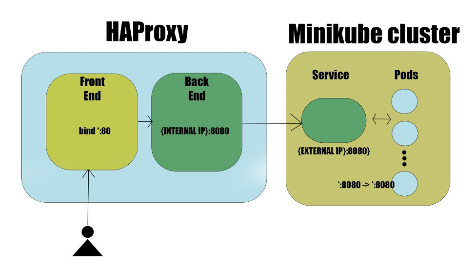

# Build Your First API Server From Scratch With JAVA and Minikube

With this project, you may build your simple API server on JAVA
without super-knowledge,  and deploy it on minikube automatically with scripts.

# Deploy it

To deploy the application to server VPS or cloud, you must have
a VPS server and account in the docker hub. Docker Hub is the world's largest library and community for container images. Using Docker Hub we can upload the images we need to share. These can then be downloaded as needed.

# MINIKUBE

1) Install Minikube on the server from the official guide.

2) HAProxy. We need a load balancer to allow external requests to our API server. So, install HAProxy to the server from here

HAProxy is a free, very fast, and reliable reverse proxy offering high availability, load balancing, and proxying for TCP and HTTP-based applications. Over the years it has become the de-facto standard open-source load balancer.

